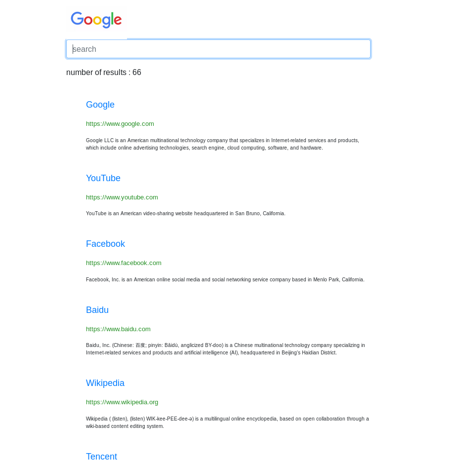

# Google-in-Flask
basic google search in flask




## Getting Started

These instructions will get you a copy of the project up and running on your local machine for development and testing purposes. See deployment for notes on how to deploy the project on a live system.

### Prerequisites

What things you need to install the software and how to install them

```
Python 3
Flask
```

python libs
**pip or pip3** deepending on you set up
On linux **pip3**

```
pip3 install Flask
pip3 install flask_sqlalchemy
pip3 install wikipedia
```

### Installing

A step by step series of examples that tell you how to get a development env running

Say what the step will be

```
git clone https://github.com/AxelGard/Google-in-Flask.git
```

And make sure that you have the libares that is needed

You can now go to [localhost:8080](http://localhost:8080/) were you can use the page

## Deployment

If you whant to depoly the site you need to
```
cd Google-in-Flask
python3 application.py
```

If you don't want to just have it on localhost you will need to set up a domin and set up port forwarding or set it up on a service like Amazon

## Built With

* [Flask](http://flask.pocoo.org/) - The web framework used

## Contributing

Please read [CONTRIBUTING.md](https://github.com/AxelGard/Google-in-Flask/issues) for details on our code of conduct, and the process for submitting pull requests to us.

## Versioning

We use [SemVer](http://semver.org/) for versioning. For the versions available, see the [tags on this repository](https://github.com/your/project/tags).

## Authors

* **Axel Gard** - *Initial work* - [AxelGard](https://github.com/AxelGard)

See also the list of [contributors](https://github.com/AxelGard/Google-in-Flask/graphs/contributors) who participated in this project.

## License

This project is licensed under the MIT License - see the [LICENSE.md](LICENSE.md) file for details

## Acknowledgments

* Hat tip to anyone whose code was used
* Inspiration off google
